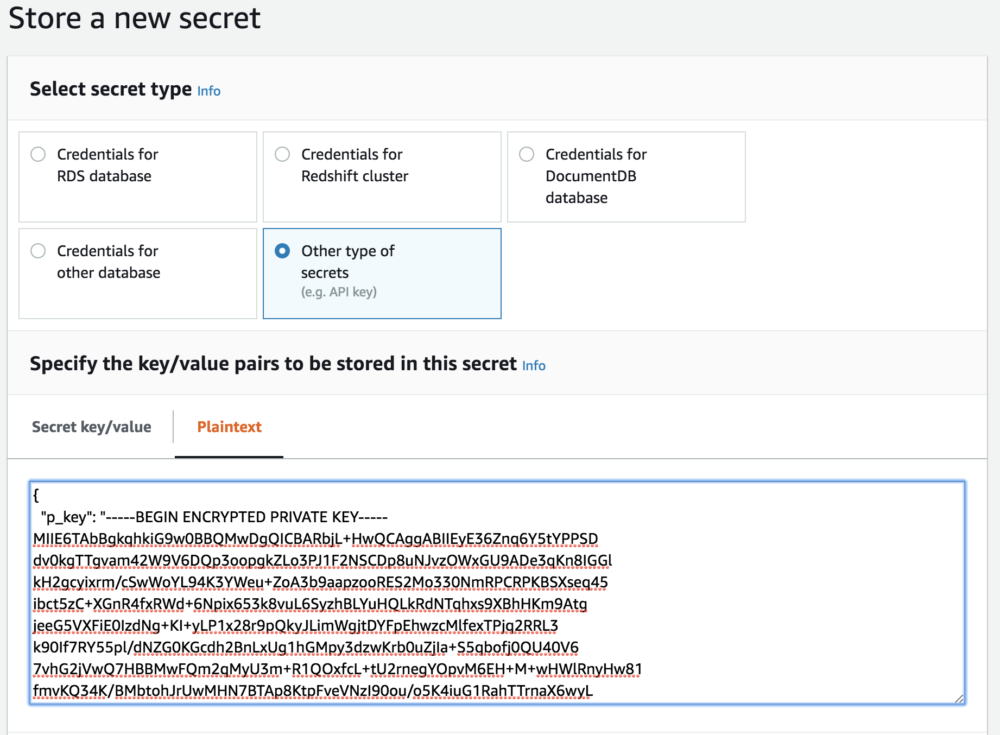
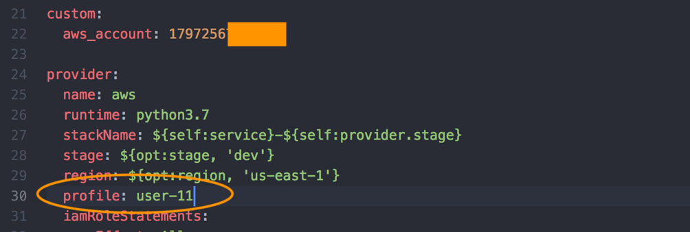
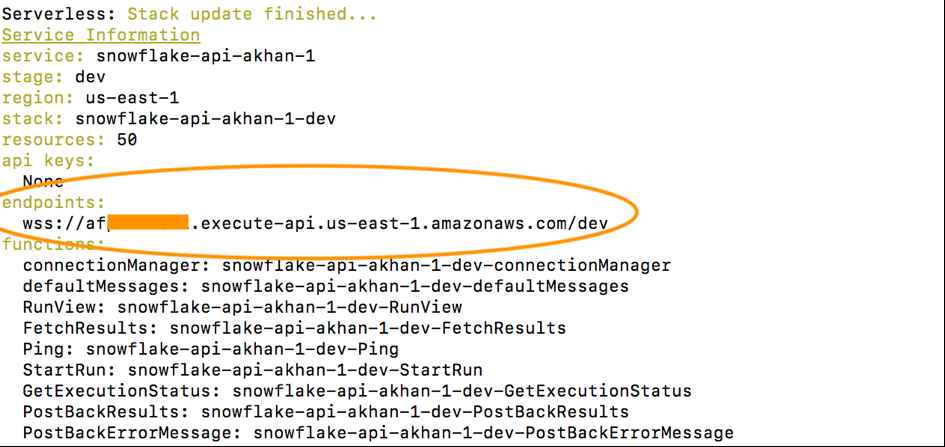

Overview
========

This is an example of how to build a serverless API that leverages Snowflake's elastic data warehouse as DB engine for analytics applications. This API also leverages advanced Snowflake features like Multi-cluster Warehouses and multiple caching layers to build a truly scalable and performant analytics API at a fraction of the cost of
legacy systems.

Requirements
============

-   Access to a Snowflake account. Get your free trial account at: https://trial.snowflake.com/

-   Administrative access to an AWS account: https://aws.amazon.com/


Architecture
===============

This API is implemented as a completely serverless solution leveraging
various AWS services including Lambda, API Gateway and Step Functions.


1.  Typical REST endpoints timeout after a few minutes. So, we've
    implemented this analytics API on websockets which lends itself
    better for long running analytical queries. The client initiates a
    connection and sends a message: `{"action": "run_view",
    "view_name": "trip_weather_vw"}`

2.  The request is routed to a Lambda function which, in turn, triggers
    an AWS Step Functions workflow.

3.  The step functions workflow initiates the query/view in Snowflake
    using the Snowflake connector for Python. The workflow then checks
    the status of the job in Snowflake every 5 seconds.

4.  Once the query/view finishes execution, the response (either results
    or error) is sent back to the client asynchronously.

Setup & Configuration
===============================

1.  Install the latest NodeJS: <https://nodejs.org/en/download/>. You can check to see if you have NodeJS installed by:
  ```
  node --version
  ```

2.  This lab uses the **Serverless** framework
    (<https://serverless.com/>) which you can install globally using:
  ```
  sudo npm install -g serverless
  ```
If installed successfully, you should be able to now check the installed version:
```
serverless --version
```

3.  The API is implemented using Python 3. Check to see if you Python 3
    installed on your machine:
```
python --version
```
OR
```
python3 --version
```
If not installed, download and install Python 3:
<https://www.python.org/downloads/>

4. If you don't already, install the AWS CLI using pip3:
```
sudo pip3 install awscli --upgrade --user
```
You can use `aws --version` command to verify if the AWS CLI was
correctly installed. If it wasn't, see this to troubleshoot:
<https://docs.aws.amazon.com/cli/latest/userguide/cli-chap-install.html>
If installing for the first time, you will need to configure AWS CLI by using:
```
aws configure
```
Make sure you have your AWS credentials handy when you configure the AWS CLI.

5.  You can check if you have Git installed already by:
```
  git --version
```
If not, install Git:
https://git-scm.com/book/en/v2/Getting-Started-Installing-Git

6.  You will also need Docker to deploy the API. Download and install from here: https://www.docker.com/products/docker-desktop

Snowflake Setup
===============

Before we get into building the API, lets setup our backend Snowflake environment correctly
so we have all the parameters ready when it comes time to edit the API code.

1. Create and save the RSA public and private keys using the procedure described here:
https://docs.snowflake.net/manuals/user-guide/snowsql-start.html#using-key-pair-authentication

Jot down the passphrase you used to encrypt the private key.

2. This example API is read-only and will get data by running a particular view within Snowflake. Lets go ahead and create a view that the API can run. Login to your Snowflake account and run the following SQL statements:

```sql
use role accountadmin;
create role if not exists snowflake_api_role;
grant usage on database CITIBIKE_API to role snowflake_api_role;
grant usage on schema CITIBIKE_API.PUBLIC to role snowflake_api_role;
grant select on all views in schema CITIBIKE_API.PUBLIC to role snowflake_api_role;
grant select on future views in schema CITIBIKE_API.PUBLIC to role snowflake_api_role;
grant usage on warehouse TEST_WH to role snowflake_api_role;

create user snowflake_api_user password='Snowfl*ke' default_role = snowflake_api_role must_change_password = false;
alter user snowflake_api_user set rsa_public_key='your_rsa_public_key'; --exclude the header and footer
grant role snowflake_api_role to user snowflake_api_user;
```

Substitutions you will need to make in the SQL above:

- Replace `CITIBIKE_API` with your database name.
- Replace `PUBLIC` with your schema name.
- Replace `TEST_WH` with the name of the warehouse you want the API to use.
- Use a different password for `snowflake_api_user`
- Use the public key you generated previously without the header and footer to set the `rsa_public_key` parameter for the `snowflake_api_user`.


3. Create a test view with some test data, switch to using the new `snowflake_api_role` and try a simple select to see if the permissions work:

```sql
use role snowflake_api_role;
select * from <your_view_name> limit 10;
```

Clone, Modify and Deploy Code
========================================

1. Clone this repo:
```
  git clone https://github.com/filanthropic/snowflake-api.git
```

2. Before the Serverless framework can deploy this code, it needs the `serverless-python-requirements` plugin so lets install that (dependency is declared in package.json)
```
cd snowflake-api/
npm install
```

snowflake-api ahkhan$ python3 -m venv .
source bin/activate
pip install -r requirements.txt

3. Open the AWS Secrets Manager and create a new secret that will hold the private key. Select 'Other type of secret' and then select `plaintext` and use `p_key` as the key and your private key that you generated in the Snowflake setup step 1 as the value.

  

Hit `Next`, give the secret a name and description. Hit `Next` again twice and then hit `Store`. Note the name you gave to the secret.

4. From within the `snowflake-api` directory, open `keypair_auth.py` and update the following line with the passphrase that you used when you created the key pair in Snowflake Setup step \#1:
```
    passkey = "<your_passphrase>"
```

5. Open `serverless.yml`. At the top of this file contains the 'service' -> 'name'
    configuration. Go ahead and change the service name to whatever you want to name this project.

6. Change AWS account number in serverless.yml


7. If using the default AWS CLI profile, remove the `profile` attribute in `serverless.yml`. If using a named profile, change it to match the AWS CLI profile you want to use to deploy:



8. In serverless.yml, update the ARN name of the secret that holds the private key you previously created:


9. Now we are ready to deploy the API to AWS. Go to the 'snowflake-api'
    folder and deploy the serverless stack:
```
serverless deploy
```
The command above will take all the code you cloned, package it up as
AWS Lambda functions and deploys them. It also creates the AWS API
Gateway endpoint with websockets and the AWS Step Functions state
machine that orchestrates the Lambda functions.

10. Go ahead and make note of the API endpoint that you just created.


Before we test our API, we need to first make sure that this API
endpoint has access to the right data in our Snowflake backend.


Module 4: Using the API
========================

The API is based on websockets because of the long running nature of analytics queries. The best way to understand how the client interacts with the API is to first install the "wscat" tool.

1. Install the "wscat"
```
sudo npm install -g wscat
```

2. Connect to the API endpoint you created in step \#13:
```
wscat -c wss://<your_api_endpoint>
```

3. In the API code, we have implemented two websocket "routes" or types
    of actions that the API supports. First one is used to run a
    particular view and is called "**run_view**" and the other one
    called "**fetch_results**" is used to fetch cached results of an
    already run query and helps the client paginate through the results
    in an efficient manner.

4. Once connected, you can run the secure view you created previously
    by running:
```
 {"action": "run_view", "view_name":"<your_view_name\>"}
```

  -------------------------------------------------------------------

The response should look something like this:


5. The response of the previous command should give you a `query_id`
    which you can use to paginate through the results:
```
{"action": "fetch_results","query_id": "<query_id>", "offset": "100"}
```

6. Open up the 'client.html' file in a browser to see how a simple HTML
    client can interact with our Snowflake API.


Additional Resources
====================

-   AWS API Gateway WebSocket Support:
    <https://docs.aws.amazon.com/apigateway/latest/developerguide/apigateway-websocket-api.html>

-   Serverless Framework: <https://serverless.com/>

-   AWS Serverless Stack: <https://aws.amazon.com/serverless/>

-   Snowflake Python Connector Keypair Auth:
    <https://docs.snowflake.net/manuals/user-guide/python-connector-example.html#using-key-pair-authentication>
